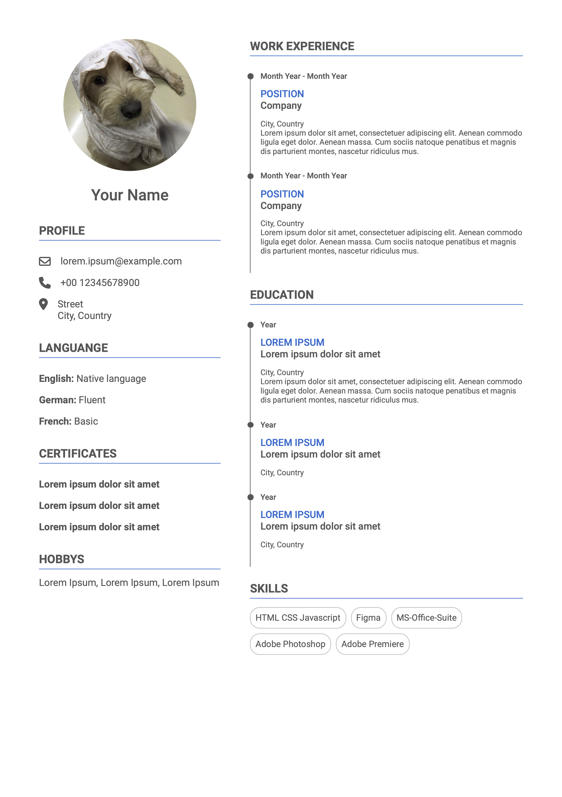

# HTML CV Template

This HTML CV Template is a simple and elegant way to create a personalized Curriculum Vitae (CV) or resume webpage. Designed with simplicity and customization in mind, this template allows you to showcase your professional experience, skills, and contact information in a clean and organized manner.

## Features

- **Clean Design**: The template features a clean and minimalistic design, making your CV easy to read and visually appealing.

- **Customizable**: Easily personalize the template by replacing the sample content with your own information.

## Usage

1. Download the template files from [GitHub](#).

2. Open the `index.html` file in a text editor of your choice.

3. Replace the sample content in the HTML file with your own information, including your name, contact details, summary, work experience, education, skills, and any other sections you wish to include.

4. Customize the CSS styles in the `style.css` file to match your preferred color scheme and formatting.

5. Add your own images or replace the profile picture with your own photo by replacing the `profile.png` file in the `img` folder.

6. Save your changes.

7. Open the `index.html` file in a web browser to preview your CV.

8. Deploy the HTML file to your website or web hosting service to share your CV online.

## Preview

## Credits

This CV template was created by [StrongOtter]. Feel free to use and modify it for your personal and professional needs. If you have any questions or suggestions for improvements, please [contact me](mailto:jieyi.mai@strongotter.com).

## License

This template is provided under the [MIT License](LICENSE). You are free to use, modify, and distribute it as per the terms of the license.
